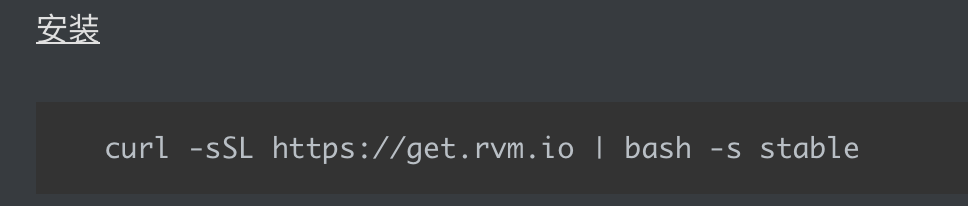

### rvm

Ruby Version Manager

[安装](https://rvm_io.global.ssl.fastly.net/)
```
curl -sSL https://get.rvm.io | bash -s stable
```
[使用](https://rvm.io/rvm/install)
```
# 查看知道的版本
rvm list known
# 已经已经安装的版本
rvm list
# 安装ruby 3.0.0版本
rvm instll 3.0.0
# 使用3.0.0版本
rvm use 3.0.0
# 设置默认版本
rvm use 3.0.0 --default
```




